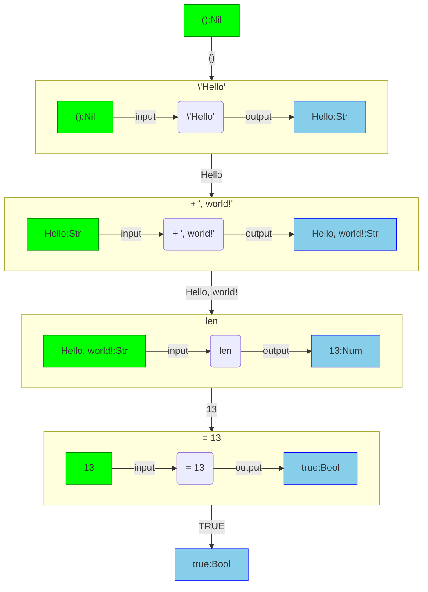

<iframe src="./.ibox.html?raw=true" style="border:none; position:fixed; width:40px; right:0; z-index=999;"></iframe>

# Pipeline Concepts

A fundamental design choice of ogma is to chunk expressions into a 'block'. Each block has a
definitive _input_ and _output_ type. This style of data flow is commonly referred to as
_pipelining_. It is more common to see pipelining in functional languages and terminal shells.
In terminal shells, the data transferred through a pipe is a stream of bytes, in ogma the data is
more structured and has a definitive _type_ when passing through a pipe.

The example below is a set of blocks, composed together producing a boolean value.
It does the following:

1. Sets the input to "Hello",
2. Appends ", world!" to "Hello",
3. Gets the length of "Hello, world!",
4. Tests if the length if equal to 13

```plaintext
\'Hello' | + ', world!' | len | = 13
```

Each of these four blocks has a definitive input and output _type_. The flowchart below shows how
each type and **data** is flowed through the pipeline.



Each command in ogma works on a specific input type. Sometimes the same named command can work on
different input types, such as `len` which returns the length of a string or the number of rows in
a table.
