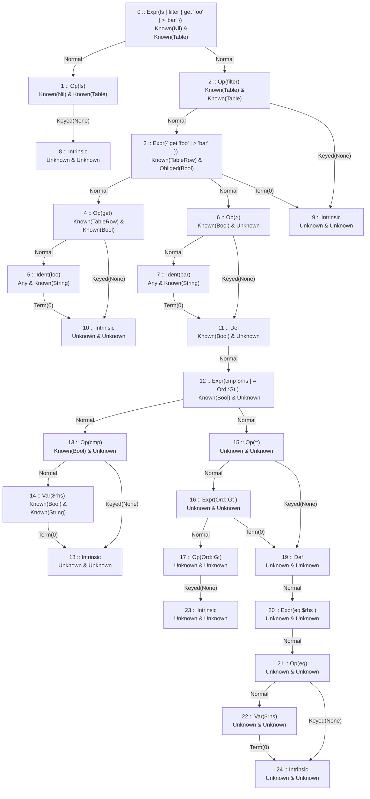
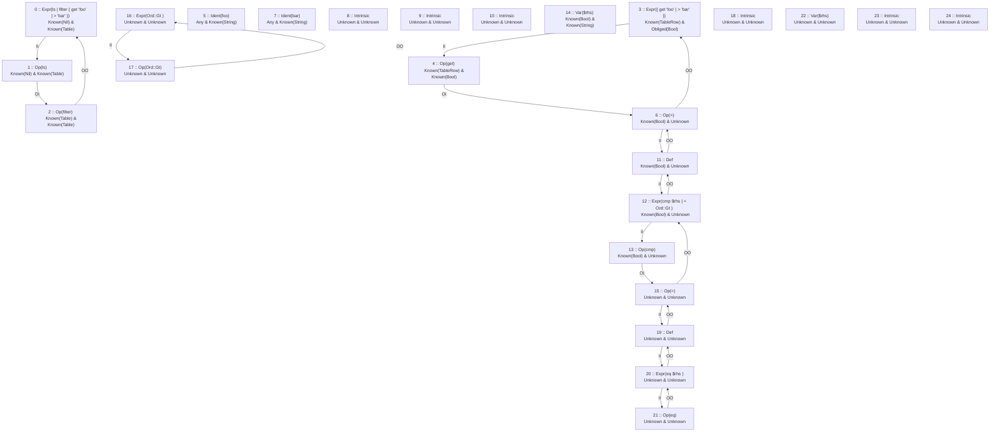

# Compiler Debug Report
## AST Graph Nodes
---
```kserd
header = ["Index","AST Node"]
data = [
    [0,"Expr(ls | filter { get 'foo' | > 'bar' })"]
    [1,"Op(ls)"]
    [2,"Op(filter)"]
    [3,"Expr({ get 'foo' | > 'bar' })"]
    [4,"Op(get)"]
    [5,"Ident(foo)"]
    [6,"Op(>)"]
    [7,"Ident(bar)"]
    [8,"Intrinsic"]
    [9,"Intrinsic"]
    [10,"Intrinsic"]
    [11,"Def"]
    [12,"Expr(cmp $rhs | = Ord::Gt )"]
    [13,"Op(cmp)"]
    [14,"Var($rhs)"]
    [15,"Op(=)"]
    [16,"Expr(Ord::Gt )"]
    [17,"Op(Ord::Gt)"]
    [18,"Intrinsic"]
    [19,"Def"]
    [20,"Expr(eq $rhs )"]
    [21,"Op(eq)"]
    [22,"Var($rhs)"]
    [23,"Intrinsic"]
    [24,"Intrinsic"]
]
rowslim = 200
```
## AST Graph Chart
---

## Type Graph Chart
---

## Current Locals
---
```
13 :: Op(cmp)
2 :: Op(filter)
4 :: Op(get)
1 :: Op(ls)
6 :: Op(>)
```
