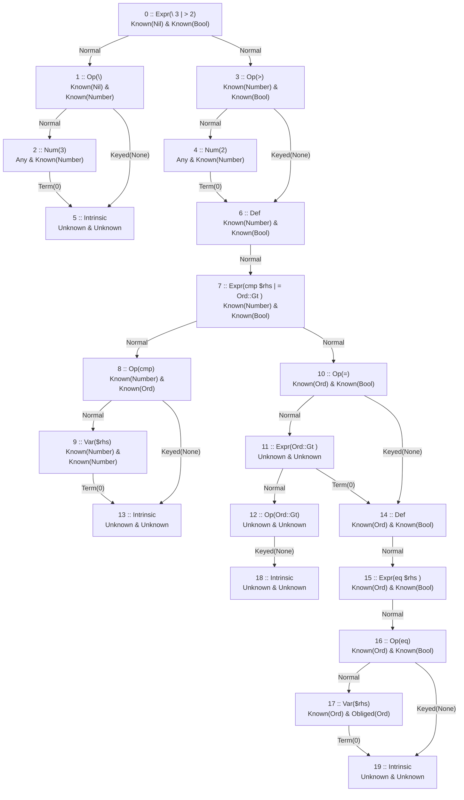
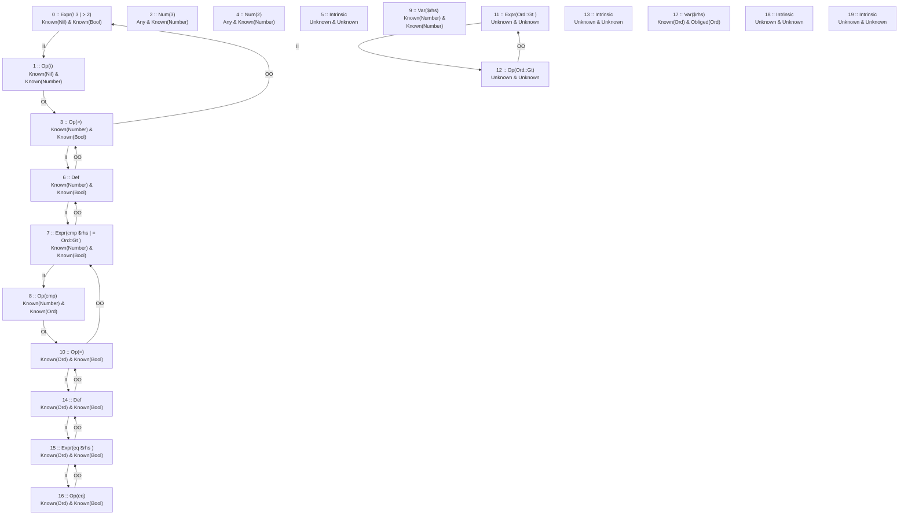

# Compiler Debug Report
## AST Graph Nodes
---
```kserd
header = ["Index","AST Node"]
data = [
    [0,"Expr(\ 3 | > 2)"]
    [1,"Op(\)"]
    [2,"Num(3)"]
    [3,"Op(>)"]
    [4,"Num(2)"]
    [5,"Intrinsic"]
    [6,"Def"]
    [7,"Expr(cmp $rhs | = Ord::Gt )"]
    [8,"Op(cmp)"]
    [9,"Var($rhs)"]
    [10,"Op(=)"]
    [11,"Expr(Ord::Gt )"]
    [12,"Op(Ord::Gt)"]
    [13,"Intrinsic"]
    [14,"Def"]
    [15,"Expr(eq $rhs )"]
    [16,"Op(eq)"]
    [17,"Var($rhs)"]
    [18,"Intrinsic"]
    [19,"Intrinsic"]
]
rowslim = 200
```
## AST Graph Chart
---

## Type Graph Chart
---

## Current Locals
---
```
8 :: Op(cmp)
10 :: Op(=)
12 :: Op(Ord::Gt)
1 :: Op(\)
3 :: Op(>)
```
